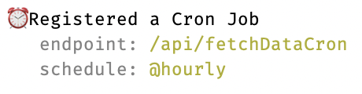

CronJobs are specified very similar to Queues:

```ts title="pages/api/someCronJob.ts"
import { CronJob } from "quirrel/next";

export default CronJob(
  "api/someCronJob", // the route that it's reachable on
  ["0 2 * * *", "Europe/Berlin"], // every day at 2AM, in Berlin time. you can also write @weekly or @daily!
  async (job) => {
    // do something
  }
);
```

:::note 🚨 Other Frameworks 🚨
The example above is for Next.js.
Take a look at how `Queue` works with _your_ framework - it's the same for `CronJob`.
:::

This creates a new CronJob, which will immediately be picked up by your local Quirrel instance:



:::note
During development, your local Quirrel instance is able to detect `CronJob()` calls by watching your source directory.
To register cron jobs on deployment, run `quirrel ci` [during deployment](/deployment/connecting)
:::

:::note
If you're struggling with cron syntax, check out [crontab guru](https://crontab.guru/).
:::

:::note
The `CronJob` call is detected using regular expressions.
This limits the first two parameters to static strings.
Using variables won't work.
:::
